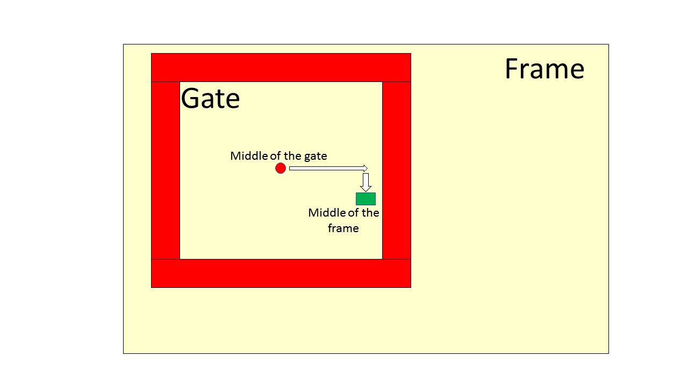
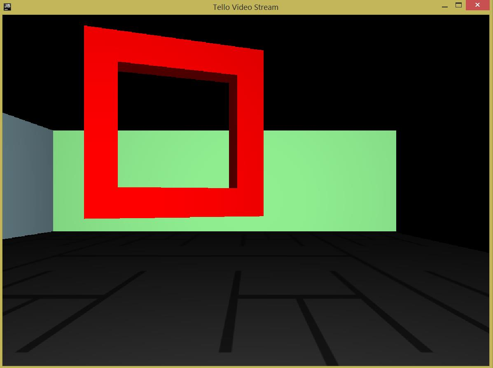
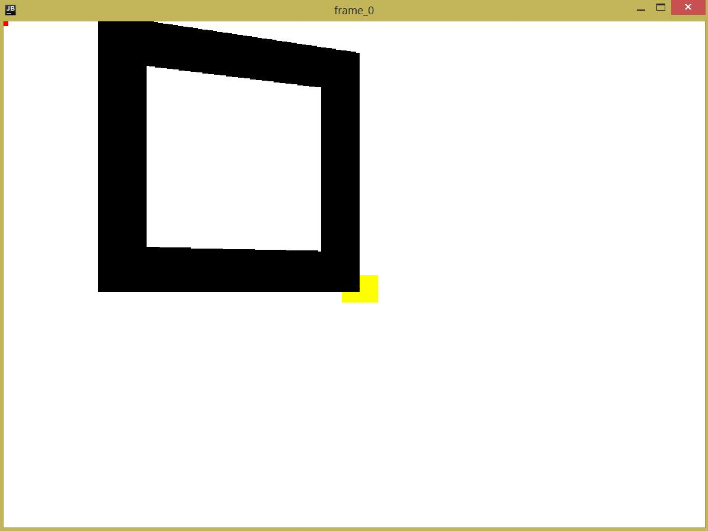
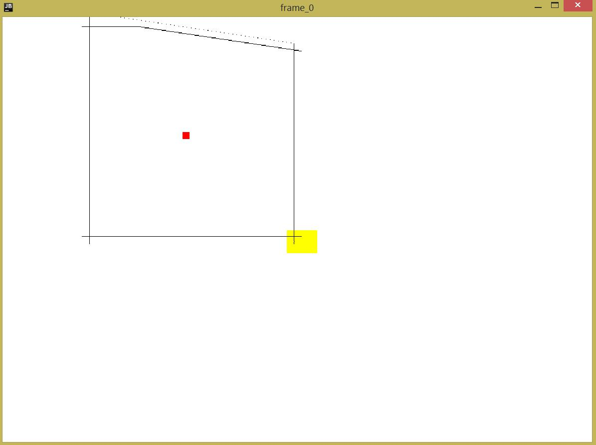
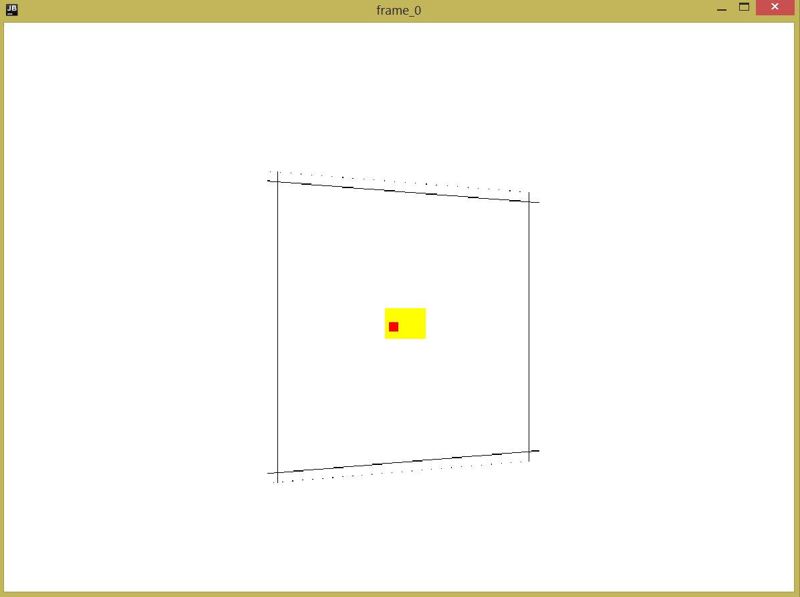
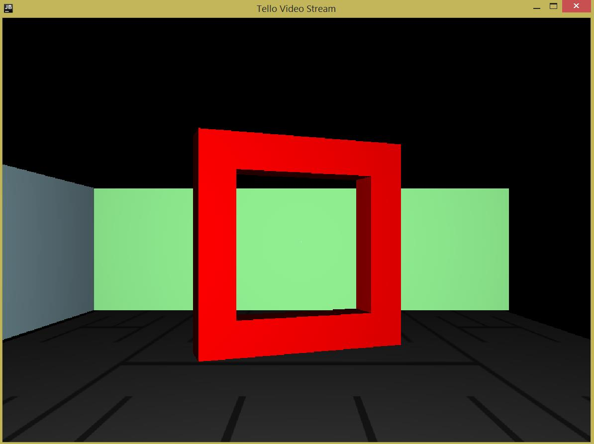

# Background

## Learning objectives

* Practice using complex classes
* Learn introductory vision processing

## Story

So far we have been been flying in open space without obstacles. However, one day you might need to explore areas with trees, mountains, etc. To be able to fly safely and not to crash your drone, we will write a program which detects obstacles and avoids them. We start with a special obstacle type - a gate.

## Gate Detection

Gate is shown in Figure 1 below. It has four sides, and an empty space in the middle. If we knew the position of a drone and a gate, we could calculate where and how much the drone should fly in order to pass through the gate. However, it is not possible when we are exploring an unknown space for the first time. We have to detect gates and fly through them automatically. To model this setup, this lab assumes that a gate position is fixed, and the drone's starting coordinates (x, y, z) are passed as command line parameters to a program.


To fly through the gate, a drone has to fly through the empty space in the middle. To detect a gate, we will be using the video feed from the front camera. Using the already used `FrameGrabber` class from previous labs, we aquire a video frame (see the Figure 2).


Since the front camera is in the middle of the drone, we need to first fly to a position where the gate's middle point will be in the middle of a frame, and after that fly forward. We can do it iteratively, by taking a frame, calculating direction to fly based on the relative position of the middle of the gate and the middle of the frame, and fly some small fixed distance. These steps can be repeated until the middle of the gate is inside of a small green box indicated the middle of the frame.


To make the detection easier, we assume that the gate stands out from surroundings by its red color. So, when we take a camera picture, we need to identify the locations of red groups of pixels. This can be done by looking at every pixel in an frame, and making a new array with the same dimensions, where an element is set to 1 when the red component of the corresponding pixel in a frame is above a given threshold. For example, after applying a filter to the above frame (Figure 2), and setting a threshold for a red channel to 160, we get the next processed frame (Figure 3):



After applying the red color filter, we have to detect edges of a gate. An image can be noisy, so to make edge detection more robust, we will be using a sliding windows over pixels. See [Moving average](https://en.wikipedia.org/wiki/Moving_average#Simple_moving_average). This windows will slide from the beginning/end of every frame's pixel row to detect a left/right edge, and from top/bottom of every frame's pixel column to detect an upper/bottom edge. For example, if we want to detect a left edge of
a gate, we start inspecting an array with filtered frame from the leftmost element in every row. When we add an element to a window, we increment the position we write and store it in a window. To make it a sliding window, we write the first element after we write the last one (see [Circular buffer](https://en.wikipedia.org/wiki/Circular_buffer)). After we add a new element, we calculate the window's average value, and if it is greater than 0.8 (remember that we set every element to 0 or 1), then we say that an edge is detected. For this lab we assume that window size is 16. If we want to detect a right border of a gate, we can start scanning from the end of the row, adding elements one by one to a sliding window. The same thing can be done to detect upper/bottom edge, but instead of scanning rows, we need to scan columns from top/bottom. After we detect all edges, we should get something like this:


Some edges may be not parallel to the frames edges, so we need to calculate an average of all left borders to get an average pixel where left edge of a gate starts. The same thing should be done for other edges.

As we described above, to fly through a gate we need to align the gate's middle point and frame's middle point. Now that we know the gate's edges, we can calucate the middle x coordinate in pixels by averaging left and right edges, and the middle y coordinate by averaging upper and bottom edges. On the above figure the middle point of a gate is shown using read square. Calculating frame's average point is easy, since we know its width and height in advance, and they are fixed. The final step is to compute two middle points and decide where the drone should fly. For example for the above figure, a drone has to fly up and left to move a red square inside of a yellow square. This can require multiple moves, but finally we should get the next image:


It corresponds to the next frame, which tells us that we can now fly forward through the gate and we won't hit any of its edges


# Part 1: Flying Through a Gate

(Name your project `lab7-flying-through-gate`)

You need **three** Java files: `Main.java`, `GateDetector.java`, and `SlidingAverage.java`.
Let's discuss them in detail.

## `Main.java`

We wrote this file for you!
Just copy and paste it into your `Main.java`.
**Keep your `package` line untouched, of course!**

```java
package ...

import com.github.ele115.tello_wrapper.FrameGrabber;
import com.github.ele115.tello_wrapper.ITelloDrone;
import com.github.ele115.tello_wrapper.Tello;
import com.github.ele115.tello_wrapper.obstacle.ObstacleGate;
import com.github.ele115.tello_wrapper.tello4j.api.video.VideoWindow;
import com.github.ele115.tello_wrapper.tello4j.api.world.FlipDirection;
import javafx.scene.paint.Color;

import java.awt.image.BufferedImage;

public class Main {
    public static void main(String[] args) {

        if (args.length != 3) {
            System.err.println("Requires three arguments: x y z");
            System.exit(1);
        }

        // You may reduce the size of all windows.
        // However, your program is NOT guaranteed to work.
        Tello.setWindowSize(960, 720);

        // Add a gate to the scene.
        Tello.getSimulator().addObstacle(new ObstacleGate(60, 250, 50, 20, Color.RED));

        // Uncomment the following line to make the camera more "realistic"
        // Tello.getSimulator().setNoisy(true);

        // Hang the program upon drone collision
        Tello.getSimulator().setOnCollision("hang"); // "hang" or "exit" or "nothing"

        // Uncomment the following lines if you don't have a good video card
        // This slows down the rendering
        // Tello.getSimulator().setSnapshotInt(300);
        // Tello.getSimulator().setDelayUpdate(true);

        int droneX = Integer.parseInt(args[0]);
        int droneY = Integer.parseInt(args[1]);
        int droneZ = Integer.parseInt(args[2]);

        // The 90 (degrees) here means that the drone is facing forward.
        ITelloDrone drone = Tello.Connect("simulator", droneX, droneY, 90);

        // You may opt-out of this window by commenting out this line.
        drone.addVideoListener(new VideoWindow());

        // ... but you don't want to comment out this line of course
        FrameGrabber frameGrabber = new FrameGrabber(1);
        drone.addVideoListener(frameGrabber);

        drone.setStreaming(true);
        drone.takeoff();
        drone.up(droneZ - 50); // Move to the desired location

        alignGateAndFrameCenters(drone, frameGrabber);

        drone.forward(-droneY + 400); // Fly to the other end of the room
        drone.flip(FlipDirection.FORWARD); // Celebrate

        drone.land();
        System.exit(0);
    }

    public static void alignGateAndFrameCenters(ITelloDrone drone, FrameGrabber frameGrabber) {
        int adjustmentDistance = 10;
        BufferedImage img;
        GateDetector gateDetector = new GateDetector(160, 0.05);
        String horizontalMove, verticalMove;
        do {
            frameGrabber.recordAndDisplay();
            img = frameGrabber.getImage(0);
            gateDetector.setImage(img);
            gateDetector.applyFilter();
            gateDetector.detectAllEdges();
            horizontalMove = gateDetector.horizontalMoveDirection();
            verticalMove = gateDetector.verticalMoveDirection();
            System.out.println("Horizontal Direction: " + horizontalMove);
            System.out.println("Vertical Direction: " + verticalMove);
            img = gateDetector.getEdgeImage();
            frameGrabber.displayImage(img, 0);

            if (horizontalMove.equals("left")) {
                System.out.println("Adjustment: left " + adjustmentDistance);
                drone.left(adjustmentDistance);
            } else if (horizontalMove.equals("right")) {
                System.out.println("Adjustment: right " + adjustmentDistance);
                drone.right(adjustmentDistance);
            }

            if (verticalMove.equals("up")) {
                System.out.println("Adjustment: up " + adjustmentDistance);
                drone.up(adjustmentDistance);
            } else if (verticalMove.equals("down")) {
                System.out.println("Adjustment: down " + adjustmentDistance);
                drone.down(adjustmentDistance);
            }
        } while (!horizontalMove.equals("good") || !verticalMove.equals("good"));
    }
}
```

## `SlidingAverage.java`

**Please follow the guide carefully.**

1. To create this file, **right click of your `Main.java` file**. Click `New`/`Java Class`.
1. Type `SlidingAverage` as the name.
1. Hit enter.
1. Now you should see a file with an empty class `public class SlidingAverage { }`.
1. Inside the class braces, you need to create the following:
    * Some class member variables to store the sliding window **wnd** (array of integers), array index for writing the next element **wrIndex**, and a counter for number of valid elements **validCnt** in a window.

    _Q: Should these members be `public` or `private`?_
    * A constructor `public SlidingAverage(int size) { ... }` that takes **size** (`int`) of the window, and which sets **wrIndex** and **validCnt** to initial values.

    _Q: What should you write inside the contructor?_
    * A method `public void addValue(int val) { ... }`. This should take a new value **val** as a parameter, and put it into the window either based on **wrIndex** to an unused position if the windows is not full, or replacing the oldest value in the window in the case when the window has the maximum specified values. Keep in mind that **wrIndex** should wrap around and point to the first element in a window after writing to he last one.

    _Q: How should you keep track of number of valid entries and current write positiong in the window?_
    * A method `public boolean isFilled() { ... }`. This method should return `true` if the number of valid entries in the window is equal to its **size**, and `false` in another case.
    * A method `public double getAverage() { ... }`. This method should return an average of valid elements in the window.

    _Q: How should you keep track of the valid entries and their sum?_


## `GateDetector.java`

**Please follow the guide carefully.**

1. To create this file, **right click of your `Main.java` file**. Click `New`/`Java Class`.
1. Type `GateDetector` as name.
1. Hit enter.
1. Now you should see a file with an empty class `public class GateDetector { }`.
1. Inside the class braces, you need to create the following:
    * A `BufferedImage` variable to store a frame, two-dimensional array of `int` **frameFiltered** to store a filtered frame, and another two-dimensional array of `int` **gateEdges** to store location of a gate edges. You can also add your own class variables in addition to mentioned above.
    * A constructor `public GateDetector(int channelThres, double alignmentErrorPerc)`, where **channelThres** is a threshold value for a channel component, and **alignmentErrorFrac** is used to determine an error for alignment of a middle point of a gate and a middle point of a frame. So, if `gateMidX` and `gateMidY` are coordinates of the gate's middle point, and `frameMidX`, and `frameMidY` are coordinates of the frame's middle point, then they are aligned if `(1-alignmentErrorFrac)*frameMidX` ≤ `gateMidX` ≤ `(1+alignmentErrorFrac)*frameMidX` and `(1-aligmentErrorFrac)*frameMidY` ≤ `gateMidY` ≤ `(1+alignmentErrorFrac)*frameMidY`
    * A method `public void setImage(BufferedImage frame) { ... }`. This method should set a class variable frame to a new frame, and define **frameFiltered** and **gateEdges**.

    _Q: Should you save frame width and height as separate variables?_
    * A method `public void applyFilter() { ... }`. This method should check _every_ pixel of a saved frame, and set corresponding bit in **frameFiltered** array to 1 if _RED_ component of a pixel is greater than a threshold value defined in a constructor.
    * A method `public void detectAllEdges() { ... }`. This should detect _left_, _right_, _upper_, and _bottom_ edge of a gate in a **frameFiltered** array, and set a corresponding bit in a **gateEdges** array where an edge starts.

    _Q: Can you make a helper function which can take an edge location as a parameter?_
    * A method `public BufferedImage getFilteredFrameImage() { ... }`. This method should return an image representation of an **frameFiltered** array.

    _Hint: You can create a new image using the next code: `BufferedImage img = new BufferedImage(<width>, <height>, BufferedImage.TYPE_INT_RGB)`. After that, you can assign RGB value for every pixel separetely._
    * A method `public BufferedImage getEdgeImage() { ... }`. This method should return an image representation of an **gateEdges** array.

    _Q: Can you write a helper private method which will convert **frameFiltered** or **gateEdges** into a BufferedImage?_
    * A method `public String horizontalMoveDirection() { ... }`. This method should return a string `left` if a drone must move to the left, `right` to move to the right, and `good` in case it can keep its current horizontal coordinate in order to align gate's and frame's middle points.
    * A method `public String verticalMoveDirection() { ... }`. This method should return a string `up` if a drone must move up, `down` to move down, and `good` in case it can keep its current vertical position in order to align gate's and frame's middle point.

# Testing

When you've finished coding, click the blue button and try three different command line arguments:

1. 120 50 60
1. 0 50 60
1. 60 -150 60
1. 0 -150 150

If everything is correct, your drone should fly through those gates without any collision.

