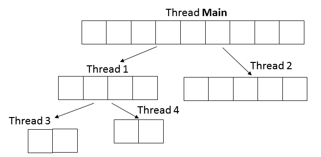

# Background

## Learning objectives

* Learn how to create and manipulate threads
* Learn how the same algorithm can be implemented as a serial or a parallel one

## Story

First, you will improve your `FakeDroneSwarm` from Lab 6 so multiple drones can fly at the same time. We are using real (well, "fake" ones in the simulator) drones now!
Recall that before you were performing an action on drones one by one. As a result, the last drone in a swarm had to wait until all the drones before it completed an action. However, if you want to make a drone show [like this](https://youtu.be/KhDEEN4gcpI?t=51), you want multiple drones to perform different actions simultaneously.

Second, you will implement two versions of a merge sort - serial and parallel. Recall that if you have multiple threads available in your system, you can start them at the same time and get a speedup compared to running only a singe thread. But the question is - what is the maximum speedup can you get?

**Attention: In this lab we are using IntelliJ IDEA, so you must submit your code to Github.**

# Before you start

We want to explain some of the common misconceptions and sticky points of threads that you will likely encounter.

## IntelliJ complains about `new Thread`

**Please read this part before you proceed.**

When you are spawning threads using Java, IntelliJ will complain about the `new Thread` syntax by making your `new Thread` gray.
Click on your gray `new Thread` to see what's happening.
At the bottom of IntelliJ IDEA, you will see that
`Anonymous new Thread() can be replaced with new Thread(() -> {...})`.
Now try to press `Alt+Enter`, make sure that
`Replace with new Thread(() -> {...})`
is selected, and press `Enter`.

You **MAY OR MAY NOT** want to follow the instruction of IntelliJ.
Either of the two syntaxes are fully correct and they are semantically equivalent.
The `new Thread() { public void run() {...} }` is the old syntax, while
`new Thread(() -> {...})` is the new syntax.
It's up to you to choose the one you like.

FYI, you can convert `new Thread(() -> {...})` into `new Thread() { public void run() {...} }` by:
1. Click on `->`
1. Hit `Alt+Enter`, select `Replace lambda with anonymous class`, hit `Enter`.
1. Remove the extra `@Override`
1. Remove the extra `new Runnable() `
1. Adjust the parentheses.

## IntelliJ complains about `t.join()`

**Please read this part before you proceed.**

To wait for a thread `t` to complete, you'd write `t.join()`.
However it won't compile and IntelliJ prompts for an error.
Click on your `join` to see what's happening
At the bottom of IntelliJ IDEA, you will see that
`Unhandled exception: java.lang.InterruptedException`.
Now try to press `Alt+Enter`, make sure that
`Surround with try/catch`
is selected, and press `Enter`.

The reason behind it is that `Thread::join` is defined as below (try to `Control`-click on the `join`, or `Command`-click if you are using macOS):
```java
public final void join() throws InterruptedException { ... }
```
and you are required to handle the possibly thrown `InterruptedException`.  Therefore you need to add a try-catch block around any join.
For now, a good way to `catch` or handle the exception is to simply print the strack trace `e.printStackTrace();` to handle it.

## IntelliJ complains about variables not being final for instance the loop variable

**Please read this part before you proceed.**

Have a look at the following code:

```java
public class Main
{
    public static void main(String[] args)
    {
        int k = 0;
        Thread t = new Thread(() -> System.out.println(k));
        t.start();
        k = 1; // IMPORTANT: will this happen before or after println(k)?
        try {
            t.join();
        } catch (InterruptedException e) {
            e.printStackTrace();
        }
    }
}
```

Such code looks "undeterministic":
`k = 1` might happen **before or after** `System.out.println(k)`
and the program will behave differently in the two situation.
Thus the people who invented Java simply *decided* that such code is ill-formed and *banned* from compiling.
Try running the code with `k = 1` commented out and not. You will notice the difference.

IntelliJ is smart and knows that `k` can change while the thread is running.
As before, click on your `k`, you can see the complainment from IntelliJ:
Either `Variable 'k' is accessed from within inner classes, needs to be final or effectively final` or
`Variable used in lambda expression should be final or effectively final`,
depending on which syntax you are using to spawn a thread.  What this means is that the variable can be changed and that is not allowed.

The term `final` and `effectively final` both mean that the variable never changes.
Only variables (from the outside of the thread) that never change can be used in a thread.
To fix such issue, simply press `Alt+Enter`, select `Copy 'k' to effectively final temp variable`.  Alternatively, you can make code like below.

```java
public class Main
{
    public static void main(String[] args)
    {
        int k = 0;
        int j = k;
        Thread t = new Thread(() -> System.out.println(j));
        t.start();
        k = 1;
        try {
            t.join();
        } catch (InterruptedException e) {
            e.printStackTrace();
        }
    }
}
```

# Part 1: Parallel Drone Swarm

(Name your project as `lab9-part1`)

You have to implement the missing methods for *ParallelDroneSwarm* class. To make your task easier, we wrote a method to place every drone at a vertex of a regular polygon. You have to implement methods in such way that all the drones in a swarm perform each steo of thier actions simultaneously. For example, if you call *swarm.forward(100)* then all the drones must fly forward 100 cm *simultaneously*.

We also implemented the *main* method for you, which makes each drone to fly to the adjacent vertex of a polygon. If you look from the top, the drones should be "dancing along "regular polygon's sides". You can experiment and make cool visual objects like in the video above!

Use the following starter code:

**Main.java**
```java
// TODO: Put your package name here!

import com.github.ele115.tello_wrapper.Tello;

public class Main
{
    public static void main(String[] args)
    {
        int polygonSideLen = 100;
        int sideNum = 4;
        double polygonOuterAngle = 360.0 / sideNum;

        Tello.getSimulator().showLabel(true);
        ParallelDroneSwarm swarm = new ParallelDroneSwarm(sideNum, polygonSideLen);
        swarm.takeoff();
        for (int i = 0; i < sideNum; i++)
        {
            swarm.forward(polygonSideLen);
            swarm.turnLeft(polygonOuterAngle);
        }
        swarm.land();

        System.exit(0);
    }
}
```

**ParallelDroneSwarm.java**
```java
// TODO: Put you package name!

import com.github.ele115.tello_wrapper.ITelloDrone;
import com.github.ele115.tello_wrapper.Tello;

public class ParallelDroneSwarm
{
    private ITelloDrone[] drones;

    public ParallelDroneSwarm(int droneNum, int sideLen)
    {
        placeDrones(droneNum, sideLen);
    }

    public void takeoff()
    {
        // TODO: complete!
    }

    public void land()
    {
        // TODO: complete!
    }

    public void forward(double cm)
    {
        // TODO: complete!
    }

    public void backward(double cm)
    {
        // TODO: complete!
    }

    public void turnLeft(double deg)
    {
        // TODO: complete!
    }

    public void turnRight(double deg)
    {
        // TODO: complete!
    }


    private void placeDrones(int droneNum, int polygonSideLen)
    {
        drones = new ITelloDrone[droneNum];
        double x, y, angle;
        double outerAngle = 360.0 / droneNum;

        x = y = 0;
        angle = outerAngle;
        for (int i = 0; i < droneNum; i++)
        {
            drones[i] = Tello.Connect("simulator", x, y, angle);
            x += polygonSideLen * Math.cos(Math.toRadians(angle));
            y += polygonSideLen * Math.sin(Math.toRadians(angle));
            angle += outerAngle;
        }
    }
}
```

You task is to complete methods in *ParallelDroneSwarm* class meeting the requirements for the swarm described above.

**Hint 1:** You should use threads.

**Hint 2:** You can add new properties and methods if needed.

After you finish all the methods, you should demo your simulation to a TA.


# Part 2: Serial versus Parallel Merge Sort

(Name your project as `lab9-part2`)

You need to implement two versions of a merge sort: a serial version and a parallel version.
Merge sort was described in a lecture and does the following:
1. Pick a middle element in an array and use it to divide an array into two parts - left and right
2. Apply the same procedure separetly for the left and the right parts
3. After both parts are sorted, you merge them together in linear time by picking the smallest (largest) element from each part sequentially.

You can find an exampe of a merge sort in the [code sample repo](https://github.com/ELE115/slide_examples/blob/master/SD15/MergeSort.java). However, pay attention to methods' parameters and return values, since we ask you to implement methods with slightly different signatures. 

We provide you with the starter code:

**Main.java**
```java
// TODO: Put your package name here!

import java.util.Arrays;
import java.util.Random;

public class Main
{
    private final static int magicSeed = 133;

    public static void main(String[] args)
    {
        int availThreadNum = Runtime.getRuntime().availableProcessors();
        int arrayLength = 8000000;
        long startT, sortT, serialTime;

        System.out.println("Your system has " + availThreadNum + " available threads");

        // Serial Merge Sort
        int[] arrForSerial = createArray(arrayLength);

        System.out.println("=== Serial Merge Sort ===");
        System.out.println("Array length: " + arrForSerial.length);
        System.out.println("Array sorted: " + isSorted(arrForSerial));
        System.out.println("Sorting using serial merge sort...");

        startT = System.nanoTime();
        serialMergeSort(arrForSerial);
        serialTime = System.nanoTime() - startT;

        if (!isSorted(arrForSerial))
        {
            System.err.println("Array must be sorted!");
            System.exit(1);
        }
        System.out.println("Array sorted successfully");
        System.out.println("Serial merge sort took " + serialTime / 1E6 + " ms");
        System.out.println();


        // Parallel Merge Sort
        System.out.println("=== Parallel Merge Sort ===");

        double maxSpeedup = 0;
        int maxThreadNum = 2 * availThreadNum;
        int maxExtraThreads = 0;
        double speedup;
        for (int i = 0; i < maxThreadNum; i++)
        {
            int[] arrForParallel = createArray(arrayLength);

            System.out.println("Array length: " + arrForParallel.length);
            System.out.println("Array sorted: " + isSorted(arrForParallel));
            System.out.println("Sorting using " + i + " extra threads");

            startT = System.nanoTime();
            parallelMergeSort(arrForParallel, i);
            sortT = System.nanoTime() - startT;

            speedup = ((double) serialTime) / sortT;
            if (speedup > maxSpeedup)
            {
                maxSpeedup = speedup;
                maxExtraThreads = i;
            }

            if (!isSorted(arrForParallel))
            {
                System.err.println("Array must be sorted!");
                System.exit(1);
            }
            System.out.println("Array sorted successfully");
            System.out.println("Parallel merge sort with " + i + " threads took " + sortT / 1E6 + " ms");
            System.out.println("Speedup over serial: " + speedup);
            System.out.println();
        }
        System.out.println("**** Summary ****");
        System.out.println("The maximum speed up of a parallel merge sort");
        System.out.print("over a serial merge sort is " + maxSpeedup + " when using ");
        System.out.println(maxExtraThreads + " out of " + availThreadNum + " available threads");
    }

    public static void parallelMergeSort(int[] arr, int maxExtraThreads)
    {
        // TODO: complete!
    }

    public static void serialMergeSort(int[] arr)
    {
        // TODO: complete!
    }

    public static boolean isSorted(int[] arr)
    {
        for (int i = 0; i < arr.length - 1; i++)
        {
            if (arr[i] > arr[i + 1])
                return false;
        }
        return true;
    }

    public static int[] createArray(int length)
    {
        int[] arr = new int[length];
        Random random = new Random(magicSeed);

        for (int i = 0; i < length; i++)
        {
            arr[i] = random.nextInt();
        }

        return arr;
    }
}
```

In the `main` method we get the number of available threads in your system using `Runtime.getRuntime().availableProcessors()` method. After that we sort the same array multiple times.

First, we apply a serial merge sort `void serialMergeSort(int[] arr)` to it and measure the amount of time it takes.
Second, we call a parallel merge sort `void parallelMergeSort(int[] arr, int maxExtraThreads)`, where we specify the maximum number of theads which should be created in addition to the main thread.
Inside the for loop `for (int i = 0; i < maxThreadNum; i++)`, we sweep `maxExtraThreads` parameter from `0` to two times the number of available threads in the system to study how sorting time changes depending on number of threads used.


Finally, we print a summary which tells what was the maximum speed up and the number of threads during that run.

## Doing a Parallel Merge Sort
When creating threads, we count them level by level (see the Figure above). Let's assume that we have a limit of four extra threads (five total, including the Main thread).

There is always at least one thread in the program - it is the Main thread. At each level of recursion up to two threads can be added (e.g. Thread 1 and Thread 2 on the Figure above). However, when the total number of threads reaches the `maxExtraThreads`, a current thread should not create any new threads and continue to process its part serially. On the Figure, the Main Thread spawns two more threads, and in turn Thread 1 spawns two more other threads. At that point Thread 2 cannot make any new thread due to extra thread limit, so it has to perform sorting serially. Note that it can be Thread 2 which creates Thread 3 and Thread 4. There is a race between two parallel threads w.r.t which one reached the code for making more threads first. It can also turn out that Thread 1 creates Thread 3 and Thread 2 creates Thread 4. However, when keeping track of the current number of threads in the program, all accesses to that variable must be synchronized to prevent race conditions when accessing it.

In the case when sub-array sorting is performed by a thread, it should be joined to a thread which created it before doing a merge step. 


You task is to implement `parallelMergeSort` and `serialMergeSort` methods.
After you complete the task, you should demo your code to a TA.

**Hint 1:** You can use the code from a lecture as a starting point. However, pay attention to method's signatures.

**Hint 2:** You can add new `static` fields and `static` methods if needed.

**Hint 3:** You can reuse some parts of the code for a serial and parallel versions.

**Hint 4:** If you need to debug your code, you can temporarily change `arrayLength` variable in the main so you can print out the whole array and inspect it. Don't forget to put it back to 8000000 after that.

**Hint 5:** You should use threads for the parallel version :)

**Hint 6:** At any given time only one thread can access a particular value in the array being sorted, so you do not need any synchronization between them (see the Figure). At the same time, as mentioned above, you might think about how to synchornize accesses to a variable keeping track of the total number of running threads.
